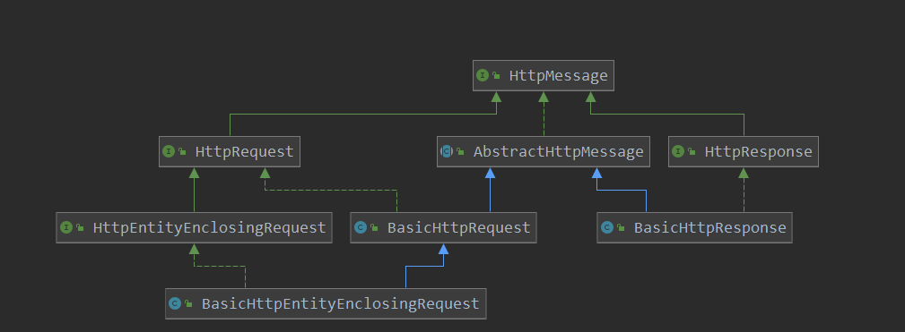
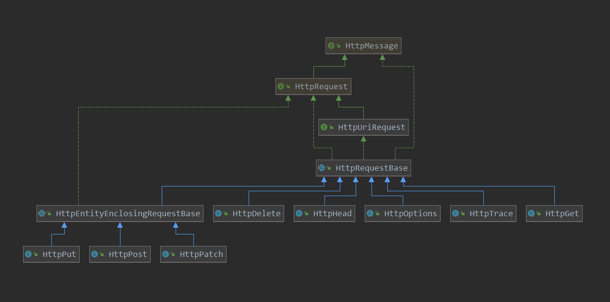

[TOC]

# 请求执行

上两篇分析了请求的申请和连接的建立，本篇来具体看一下一个请求的执行。

看一下请求消息的类图:



在看一下请求的类图：




```java
    // 真正执行 请求的地方
	// 省略非关键代码
    @Override
    public CloseableHttpResponse execute(
            final HttpRoute route,
            final HttpRequestWrapper request,
            final HttpClientContext context,
            final HttpExecutionAware execAware) throws IOException, HttpException {
        // 从pool中 获取一个 连接,即socket 连接
        // 获取连接,此返回一个  future
        // --- 重点 ----  去连接池中请求一个连接
        final ConnectionRequest connRequest = connManager.requestConnection(route, userToken);
        // 获取 requestConfig
        final RequestConfig config = context.getRequestConfig();

        final HttpClientConnection managedConn;
            // 获取连接超时时间
            final int timeout = config.getConnectionRequestTimeout();
            // 真正获取连接的地方
            // 获取刚刚请求的连接
            managedConn = connRequest.get(timeout > 0 ? timeout : 0, TimeUnit.MILLISECONDS);
        // 创建一个 连接 holder
        final ConnectionHolder connHolder = new ConnectionHolder(this.log, this.connManager, managedConn);
            HttpResponse response;
                // 建立一条到目的主机的 route,真正创建socket 连接
                // ----- 重点 -------------
                establishRoute(proxyAuthState, managedConn, route, request, context);
                // 执行请求,并得到请求体
                // 开始执行请求
                // ---- 重点 --------
                response = requestExecutor.execute(request, managedConn, context);
			.....//  省略非关键代码
            }
```

> org.apache.http.protocol.HttpRequestExecutor#execute

```java
// 执行请求,并获取到 response
public HttpResponse execute(
    final HttpRequest request,
    final HttpClientConnection conn,
    final HttpContext context) throws IOException, HttpException {
    Args.notNull(request, "HTTP request");
    Args.notNull(conn, "Client connection");
    Args.notNull(context, "HTTP context");
    try {
        // 发送请求,并得到 响应结果
        HttpResponse response = doSendRequest(request, conn, context);
        if (response == null) {
            // 如果上面没有得到响应体,这里会在此执行  直到得到响应体
            response = doReceiveResponse(request, conn, context);
        }
        return response;
    } catch (final IOException ex) {
        closeConnection(conn);
        throw ex;
    } catch (final HttpException ex) {
        closeConnection(conn);
        throw ex;
    } catch (final RuntimeException ex) {
        closeConnection(conn);
        throw ex;
    }
}
```

这里就执行了两个功能，一个是执行请求，一个是获取响应，本次先看请求的执行。

> org.apache.http.protocol.HttpRequestExecutor#doSendRequest

```java
// 真正发送请求
protected HttpResponse doSendRequest(
    final HttpRequest request,
    final HttpClientConnection conn,
    final HttpContext context) throws IOException, HttpException {
    Args.notNull(request, "HTTP request");
    Args.notNull(conn, "Client connection");
    Args.notNull(context, "HTTP context");
    // 记录响应
    HttpResponse response = null;
    // 记录一些属性到 context中
    context.setAttribute(HttpCoreContext.HTTP_CONNECTION, conn);
    context.setAttribute(HttpCoreContext.HTTP_REQ_SENT, Boolean.FALSE);
    // 1. 写请求头数据
    // "GET /index.html HTTP/1.1"  以及  requestHeader 写入到buffer中
    // ---- 重点 --------
    conn.sendRequestHeader(request);
    // 2. 如果有请求体,则这里处理请求体内容
    if (request instanceof HttpEntityEnclosingRequest) {
        // Check for expect-continue handshake. We have to flush the
        // headers and wait for an 100-continue response to handle it.
        // If we get a different response, we must not send the entity.
        boolean sendentity = true;
        // 2.1 获取此次请求的协议版本
        final ProtocolVersion ver =
            request.getRequestLine().getProtocolVersion();
        // 2.2 根据请求头Expect ,判断是否继续进行
        if (((HttpEntityEnclosingRequest) request).expectContinue() &&
            !ver.lessEquals(HttpVersion.HTTP_1_0)) {
            // 2.3 flush 缓存到对端
            conn.flush();
            // As suggested by RFC 2616 section 8.2.3, we don't wait for a
            // 100-continue response forever. On timeout, send the entity.
            // 2.3 这里判断 是否有响应, 主要是从输入流中读取数据 或者 看输入缓存中是否有数据
            if (conn.isResponseAvailable(this.waitForContinue)) {
                // 2.4 解析响应信息
                response = conn.receiveResponseHeader();
                // 是否有 请求体
                // 2.5 head 请求无请求体, 然后根据响应码 来判断是否有请求体
                if (canResponseHaveBody(request, response)) {
                    // 2.6 解析请求体
                    conn.receiveResponseEntity(response);
                }
                // 2.6 根据响应码 来判断是否继续
                final int status = response.getStatusLine().getStatusCode();
                if (status < 200) {
                    if (status != HttpStatus.SC_CONTINUE) {
                        throw new ProtocolException(
                            "Unexpected response: " + response.getStatusLine());
                    }
                    // discard 100-continue
                    response = null;
                } else {
                    sendentity = false;
                }
            }
        }
        // 3. 发送请求体
        if (sendentity) {
            conn.sendRequestEntity((HttpEntityEnclosingRequest) request);
        }
    }
    // 3. flush 缓存,即把数据写出
    conn.flush();
    // 4. 记录此处请求完成
    context.setAttribute(HttpCoreContext.HTTP_REQ_SENT, Boolean.TRUE);
    // 5. 返回响应
    return response;
}
```

这里就是真正发送请求的地方了，这里我们小结一下：

1. 发送请求行以及请求头
2. 如果request是HttpEntityEnclosingRequest，即可能是HttpPut、HttpPost、HttpPatch，则尝试发送请求体
   1. 如果request设置了  Expect请求头，且值是100-continue，则尝试把上面的请求先发送，并等待一段时间查看是否有response
   2. flush 上面发送的数据
   3. 查看是否响应（1) 输入缓存中有数据  2) 从输入流中读取数据）,如果有响应，则解析响应
   4. 在根据响应的返回码，判断是否继续
3. 如果有请求体，则发送请求体
4. flush输出缓存
5. 记录此请求完成
6. 返回响应

这里看一下请求的发送和请求体的发送，响应的解析放到后面。

发送器请求：

> org.apache.http.impl.DefaultBHttpClientConnection#sendRequestHeader

```java
// 发送请求行 到输出缓存中
@Override
public void sendRequestHeader(final HttpRequest request)
    throws HttpException, IOException {
    Args.notNull(request, "HTTP request");
    // 1. 确认流已经打开了
    ensureOpen();
    // 2. 把request写入到 buffer中
    this.requestWriter.write(request);
    // 扩展方法
    onRequestSubmitted(request);
    // 3. 增加 输出
    incrementRequestCount();
}
```

> org.apache.http.impl.BHttpConnectionBase#ensureOpen

```java
// 输入输出buffer 绑定 到输入输出流
protected void ensureOpen() throws IOException {
    // 获取socket
    final Socket socket = this.socketHolder.get();
    // 如果还没有创建 连接,则报错
    if (socket == null) {
        throw new ConnectionClosedException();
    }
    // 绑定输入 buffer
    if (!this.inBuffer.isBound()) {
        this.inBuffer.bind(getSocketInputStream(socket));
    }
    // 输出buffer 是否绑定了 socket的stream
    if (!this.outbuffer.isBound()) {
        // 没有绑定 则进行绑定
        this.outbuffer.bind(getSocketOutputStream(socket));
    }
}
```

> org.apache.http.impl.io.AbstractMessageWriter#write

```java
// 输出 请求信息,不包括请求体
@Override
public void write(final T message) throws IOException, HttpException {
    Args.notNull(message, "HTTP message");
    // 1. 把"GET /index.html HTTP/1.1" 写入
    writeHeadLine(message);
    // 2. 请求 头 写入
    for (final HeaderIterator it = message.headerIterator(); it.hasNext(); ) {
        final Header header = it.nextHeader();
        this.sessionBuffer.writeLine
            (lineFormatter.formatHeader(this.lineBuf, header));
    }
    this.lineBuf.clear();
    // 这里相当于 再写入一个 空行, 用于和 请求体 隔离开
    this.sessionBuffer.writeLine(this.lineBuf);
}
```

这里可以看到把请求行(GET /index.html HTTP/1.1)以及其他的请求header写入到输出缓冲区中。具体的写入操作如下：

> org.apache.http.impl.io.DefaultHttpRequestWriter#writeHeadLine

```java
    @Override
    protected void writeHeadLine(final HttpRequest message) throws IOException {
        // "GET /index.html HTTP/1.1" 写入到  lineBuf 中
        lineFormatter.formatRequestLine(this.lineBuf, message.getRequestLine());
        // 把lineBuf中的数据 写入到 sessionBuffer中
        this.sessionBuffer.writeLine(this.lineBuf);
    }
```

```java
// non-javadoc, see interface LineFormatter
@Override
public CharArrayBuffer formatRequestLine(final CharArrayBuffer buffer,
                                         final RequestLine reqline) {
    Args.notNull(reqline, "Request line");
    final CharArrayBuffer result = initBuffer(buffer);
    // 把"GET /index.html HTTP/1.1"写入到缓存中  result中
    doFormatRequestLine(result, reqline);
    // 返回结果
    return result;
}

// 格式化 request line 到buffer中
protected void doFormatRequestLine(final CharArrayBuffer buffer,
                                   final RequestLine reqline) {
    // 获取请求方法
    final String method = reqline.getMethod();
    // 获取 uri
    final String uri    = reqline.getUri();

    // room for "GET /index.html HTTP/1.1"
    final int len = method.length() + 1 + uri.length() + 1 +
        estimateProtocolVersionLen(reqline.getProtocolVersion());
    // 保证缓存的长度是可以的
    buffer.ensureCapacity(len);
    // 追加数据进入
    // 1. 写入method
    // 2. 在写入空格
    // 3. 在写入uri
    // 4. 写入空格
    // 5. 写入版本
    buffer.append(method);
    buffer.append(' ');
    buffer.append(uri);
    buffer.append(' ');
    appendProtocolVersion(buffer, reqline.getProtocolVersion());
}
```

> org.apache.http.impl.io.SessionOutputBufferImpl#writeLine(org.apache.http.util.CharArrayBuffer)

```java
// 此在写http 的请求头时调用.即把请求头信息写入到buffer中
@Override
public void writeLine(final CharArrayBuffer charbuffer) throws IOException {
    if (charbuffer == null) {
        return;
    }
    // 如果没有 编码
    // 则直接写入
    if (this.encoder == null) {
        int off = 0;
        int remaining = charbuffer.length();
        // 把输出写入到 buffer中
        while (remaining > 0) {
            // chunk 可写入的大小
            int chunk = this.buffer.capacity() - this.buffer.length();
            // 选择一个小的
            chunk = Math.min(chunk, remaining);
            // 开始追加数据到  buffer中
            if (chunk > 0) {
                this.buffer.append(charbuffer, off, chunk);
            }
            // 如果buffer中的数据满了,则flush一次,即把buffer中的数据写入到 socket中
            if (this.buffer.isFull()) {
                flushBuffer();
            }
            // 位置信息 更新
            off += chunk;
            remaining -= chunk;
        }
    } else {
        // 如果有编码,则使用编码写入
        // charBuffer 使用
        final CharBuffer cbuf = CharBuffer.wrap(charbuffer.buffer(), 0, charbuffer.length());
        // 编码数据 然后再写入到 buffer中
        writeEncoded(cbuf);
    }
}
// 写入换行符
write(CRLF);
}
```

这里看一下flush操作和 writeEncoded:

> org.apache.http.impl.io.SessionOutputBufferImpl#flushBuffer

```java
// flushBuffer 即把buffer中的信息 写出
private void flushBuffer() throws IOException {
    final int len = this.buffer.length();
    if (len > 0) {
        streamWrite(this.buffer.buffer(), 0, len);
        this.buffer.clear();
        this.metrics.incrementBytesTransferred(len);
    }
}

// 把buffer中的消息写出去
private void streamWrite(final byte[] b, final int off, final int len) throws IOException {
    Asserts.notNull(outStream, "Output stream");
    this.outStream.write(b, off, len);
}
```

可以看到，这里的flush操作，就是把buffer中的数据写入到buffer中。

> org.apache.http.impl.io.SessionOutputBufferImpl#writeEncoded

```java
// 先编码 在写入到到缓存
private void writeEncoded(final CharBuffer cbuf) throws IOException {
    if (!cbuf.hasRemaining()) {
        return;
    }
    // 中间缓存区,用于存储编码的信息
    if (this.bbuf == null) {
        this.bbuf = ByteBuffer.allocate(1024);
    }
    // 编码重置
    this.encoder.reset();
    while (cbuf.hasRemaining()) {
        // 对要写入的信息 进行 编码
        final CoderResult result = this.encoder.encode(cbuf, this.bbuf, true);
        // 处理编码后的信息
        handleEncodingResult(result);
    }
    final CoderResult result = this.encoder.flush(this.bbuf);
    handleEncodingResult(result);
    this.bbuf.clear();
}

// -----------------------------------------------------------------------------
// 把编码后的信息  写入到buffer中
private void handleEncodingResult(final CoderResult result) throws IOException {
    // 如果有错误,则抛出错误
    if (result.isError()) {
        result.throwException();
    }
    // 准备读 bbuf中的信息
    this.bbuf.flip();
    while (this.bbuf.hasRemaining()) {
        // 把bbuf中的信息 写到 buffer中
        write(this.bbuf.get());
    }
    // 把buffer中省下数据拷贝到开始
    this.bbuf.compact();
}
// -----------------------------------------------------------------------------
// 把字节数据写入到 buffer中
@Override
public void write(final int b) throws IOException {
    // 如果允许分段,则直接追加到buffer中
    if (this.fragementSizeHint > 0) {
        if (this.buffer.isFull()) {
            flushBuffer();
        }
        // 追加到   buffer中
        this.buffer.append(b);
    } else {
        // 如果不允许片段, 那就直接从流中写出
        flushBuffer();
        this.outStream.write(b);
    }
}
```

这里的编码写出，主要就是对数据进行编码后，然后根据是否分段进一步处理：

1. 如果允许分段，则把数据追加到输出buffer中，buffer满了，则flush 
2. 如果不允许分段，则先flush buffer中数据，之后把新的数据直接写入到输出流中

上面就是对请求行的写入操作，下面在看一下请求头的写入操作，先看一下请求头的类图：


> org.apache.http.impl.io.AbstractMessageWriter#write

```java
// 输出 请求信息,不包括请求体
@Override
public void write(final T message) throws IOException, HttpException {
    Args.notNull(message, "HTTP message");
    // 1. 把"GET /index.html HTTP/1.1" 写入
    writeHeadLine(message);
    // 2. 请求 头 写入
    for (final HeaderIterator it = message.headerIterator(); it.hasNext(); ) {
        final Header header = it.nextHeader();
        this.sessionBuffer.writeLine
            (lineFormatter.formatHeader(this.lineBuf, header));
    }
    this.lineBuf.clear();
    // 这里相当于 再写入一个 空行, 用于和 请求体 隔离开
    this.sessionBuffer.writeLine(this.lineBuf);
}
```

可以看到请求头的信息同样是一行一行写入的，和请求行是一样的，这里主要看一些对请求头的format操作。

> org.apache.http.message.BasicLineFormatter#formatHeader(org.apache.http.util.CharArrayBuffer, org.apache.http.Header)

```java
// 格式化请求头
@Override
public CharArrayBuffer formatHeader(final CharArrayBuffer buffer,
                                    final Header header) {
    Args.notNull(header, "Header");
    final CharArrayBuffer result;
	// 已经格式化的header 就不需要格式化了
    if (header instanceof FormattedHeader) {
        // If the header is backed by a buffer, re-use the buffer
        result = ((FormattedHeader)header).getBuffer();
    } else {
        result = initBuffer(buffer);
        doFormatHeader(result, header);
    }
    return result;

} // formatHeader
```

> org.apache.http.message.BasicLineFormatter#initBuffer

```java
   // 初始化buffer, buffer有内容则清空,buffer不存在则创建
    protected CharArrayBuffer initBuffer(final CharArrayBuffer charBuffer) {
        CharArrayBuffer buffer = charBuffer;
        if (buffer != null) {
            buffer.clear();
        } else {
            buffer = new CharArrayBuffer(64);
        }
        return buffer;
    }
```

> org.apache.http.message.BasicLineFormatter#doFormatHeader

```java
// 格式化请求头
protected void doFormatHeader(final CharArrayBuffer buffer,
                              final Header header) {
    // 获得请求头的 name
    final String name = header.getName();
    // 获得请求头的 value
    final String value = header.getValue();
    // name: value(换行)   +2 应该是 ": "
    int len = name.length() + 2;
    if (value != null) {
        len += value.length();
    }
    // 保证buffer的长度足够
    buffer.ensureCapacity(len);
    // 追加名字
    buffer.append(name);
    // 追加
    buffer.append(": ");
    // 追加 value
    if (value != null) {
        buffer.ensureCapacity(buffer.length() + value.length());
        for (int valueIndex = 0; valueIndex < value.length(); valueIndex++) {
            char valueChar = value.charAt(valueIndex);
            if (valueChar == '\r'
                || valueChar == '\n'
                || valueChar == '\f'
                || valueChar == 0x0b) {
                valueChar = ' ';
            }
            buffer.append(valueChar);
        }
    }
}
```

到这里请求就发送完了，下面看一下请求体的发送。

> org.apache.http.impl.DefaultBHttpClientConnection#sendRequestEntity

```java
// 发送请求体
@Override
public void sendRequestEntity(final HttpEntityEnclosingRequest request)
    throws HttpException, IOException {
    Args.notNull(request, "HTTP request");
    // 保证流已经打开, 并进行了绑定
    ensureOpen();
    // 获取请求体
    final HttpEntity entity = request.getEntity();
    if (entity == null) {
        return;
    }
    //
    final OutputStream outStream = prepareOutput(request);
    // 把entity 数据写入到  outStream中
    // 此处的outStream 就是输出流
    entity.writeTo(outStream);
    outStream.close();
}
```

> org.apache.http.impl.BHttpConnectionBase#prepareOutput

```java
// 决定entity的输出长度
@Override
public long determineLength(final HttpMessage message) throws HttpException {
    Args.notNull(message, "HTTP message");
    // Although Transfer-Encoding is specified as a list, in practice
    // it is either missing or has the single value "chunked". So we
    // treat it as a single-valued header here.
    // 1. 获取 Transfer-Encoding , 根据其 encoding的类型来决定长度
    final Header transferEncodingHeader = message.getFirstHeader(HTTP.TRANSFER_ENCODING);
    if (transferEncodingHeader != null) {
        final String s = transferEncodingHeader.getValue();
        // 1.1 如果Transfer-Encoding值为 chunked
        if (HTTP.CHUNK_CODING.equalsIgnoreCase(s)) {
            // 如果版本小于1.0, 则不支持 如果Transfer-Encoding = chunked
            if (message.getProtocolVersion().lessEquals(HttpVersion.HTTP_1_0)) {
                throw new ProtocolException(
                    "Chunked transfer encoding not allowed for " +
                    message.getProtocolVersion());
            }
            // 则返回长度为 -2
            return CHUNKED;
            // 1.2 如果 Transfer-Encoding值为 identity
        } else if (HTTP.IDENTITY_CODING.equalsIgnoreCase(s)) {
            // 返回长度为-1
            return IDENTITY;
        } else {
            throw new ProtocolException(
                "Unsupported transfer encoding: " + s);
        }
    }
    // 查看是否有 Content-Length 这个请求头,其指出了 长度
    final Header contentLengthHeader = message.getFirstHeader(HTTP.CONTENT_LEN);
    if (contentLengthHeader != null) {
        final String s = contentLengthHeader.getValue();
        try {
            // 得到 Content-Length的值,其表示的就是entity的长度
            final long len = Long.parseLong(s);
            if (len < 0) {
                throw new ProtocolException("Negative content length: " + s);
            }
            return len;
        } catch (final NumberFormatException e) {
            throw new ProtocolException("Invalid content length: " + s);
        }
    }
    return this.implicitLen;
}
```

> org.apache.http.impl.BHttpConnectionBase#createOutputStream

```java
    // 创建输出流
    // 注入哦 这里的 outBuffer 就是输出缓存区
    protected OutputStream createOutputStream(
            final long len,
            final SessionOutputBuffer outbuffer) {
        // 如果长度为  -2 ,则是 chunked 流
        if (len == ContentLengthStrategy.CHUNKED) {
            return new ChunkedOutputStream(2048, outbuffer);
            // 如果长度为 -1,则创建 IdentityOutputStream 流
        } else if (len == ContentLengthStrategy.IDENTITY) {
            return new IdentityOutputStream(outbuffer);
        } else {
            // 否则创建 ContentLengthOutputStream
            return new ContentLengthOutputStream(outbuffer, len);
        }
    }
```

> org.apache.http.entity.StringEntity#writeTo

```java
// 把内容写入到输出流中
@Override
public void writeTo(final OutputStream outStream) throws IOException {
    Args.notNull(outStream, "Output stream");
    outStream.write(this.content);
    outStream.flush();
}
```

到这里就把entity中的内容就写入到了输出流中。

这里看一下请求体的类型：


到这里，就把请求行  请求头  请求体都进行了发送。下篇看一下响应的解析。


