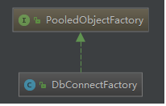
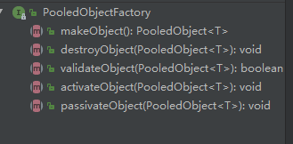
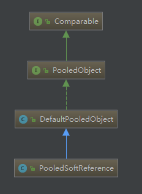
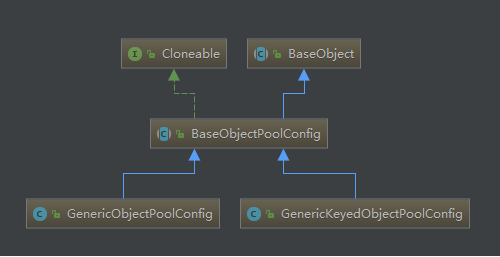
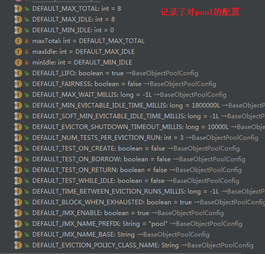
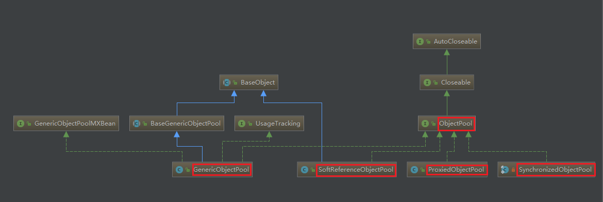
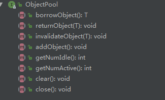

# commons-pool池化解析

## 1.框架概述

了解一个技术，当然需要了解一下其到底解决了什么问题，那就先大概说一下此能解决什么问题。对于一个一些重要的操作，如数据库连接，ftp客户端等，每次连接释放，那肯定会消耗很多时间。如何解决呢？按照大家平时的使用，肯定想到了数据库连接池，对啊。而commons-pool就成为池化技术，其把创建好的连接保存起来，每次使用时去池子中获取一个，使用完后，在归还到池子中，省去了中间释放以及连接的操作，节省了很多时间。

今天呢，咱们了解一下common-pool的实现。


从上面可以看到有四大元素，每个元素用处如下：

1. object，要具体池化的对象
2. pooledObject，对object的一个封装，是池子中具体存储的对象
3. pool，具体存储对象的池
4. factory，创建对象的工厂

咱们下面就从逐个介绍上面的四个元素。

## 2.factory

这是工厂类的继承图：



其接口方法：



其接口方法有5个，作用分别是：

```java
  PooledObject<T> makeObject() throws Exception;   // 创建对象
  void destroyObject(PooledObject<T> p) throws Exception; // 销毁对象
  boolean validateObject(PooledObject<T> p); // 校验对象
  void activateObject(PooledObject<T> p) throws Exception; // 使能对象
  void passivateObject(PooledObject<T> p) throws Exception; // 非初始化对象
```


## 3.pooledObject



对具体的对象的封装，其保存了一些其他信息，如：当前的状态，借出时间等。。


## 4.pool

poolConfig记录的对此pool的一些配置，如：设置总数，设置idle的最大最小数量等信息。






工厂有了，配置有了，咱们一路到底直接看pool。 首先看一下pool的类图，可以ObjectPool有四个实现类，也分别代表了四种池化方式。GenericObjectPool是一般的池化方式，SoftReferenceObjectPool是对象存储弱引用(GC时会回收)，ProxiedObjectPool是代理对象池(用的比较少)，SynchronizedObjectPool目前还没有了解。

这里咱们主要看一下GenericObjectPool和SoftReferenceObjectPool的使用。



从上可了解到pool的主要方法就是：获取对象，回收对象，校验对象，添加对象，获取idle数量，获取active的数量，清空，close。  咱们就主要看一下上面方法的实现：

### 4-1 field

```java
// 默认配置
private volatile int maxIdle = GenericObjectPoolConfig.DEFAULT_MAX_IDLE;
private volatile int minIdle = GenericObjectPoolConfig.DEFAULT_MIN_IDLE;
// 创建对象的工厂类
private final PooledObjectFactory<T> factory;
// 具体存储对象
private final LinkedBlockingDeque<PooledObject<T>> idleObjects;
// 创建的对象的数量
private final AtomicLong createCount = new AtomicLong(0);
// 创建对象的数量
private long makeObjectCount = 0;
// 创建对象时使用的锁
private final Object makeObjectCountLock = new Object();
// 存放所有创建的对象
private final Map<IdentityWrapper<T>, PooledObject<T>> allObjects =
    new ConcurrentHashMap<>();
```


### 4-2 constructor

```java
public GenericObjectPool(final PooledObjectFactory<T> factory,
                         final GenericObjectPoolConfig<T> config) {
    super(config, ONAME_BASE, config.getJmxNamePrefix());
    if (factory == null) {
        jmxUnregister(); // tidy up
        throw new IllegalArgumentException("factory may not be null");
    }
    // 赋值工厂类
    this.factory = factory;
    // 创建存储对象的容器
    idleObjects = new LinkedBlockingDeque<>(config.getFairness());
    setConfig(config);
}

// 设置config
public void setConfig(final GenericObjectPoolConfig<T> conf) {
    super.setConfig(conf);
    setMaxIdle(conf.getMaxIdle());
    setMinIdle(conf.getMinIdle());
    setMaxTotal(conf.getMaxTotal());
}
```


### 4-3 borrowObject

```java
// 获取对象
public T borrowObject() throws Exception {
    return borrowObject(getMaxWaitMillis());
}


public T borrowObject(final long borrowMaxWaitMillis) throws Exception {
    assertOpen();
    final AbandonedConfig ac = this.abandonedConfig;
    if (ac != null && ac.getRemoveAbandonedOnBorrow() &&
        (getNumIdle() < 2) &&
        (getNumActive() > getMaxTotal() - 3) ) {
        removeAbandoned(ac);
    }
    // 获取对象
    PooledObject<T> p = null;
    // 没有对象可用时，是否阻塞
    final boolean blockWhenExhausted = getBlockWhenExhausted();
    boolean create;
    // 记录时间，用于判断超时
    final long waitTime = System.currentTimeMillis();
    while (p == null) {
        create = false;
        // 从容器获取对象
        p = idleObjects.pollFirst();
        if (p == null) { // 没有获取到, 则进行创建
            p = create();
            if (p != null) { // 是否创建
                create = true;
            }
        }
        if (blockWhenExhausted) { // 如果允许阻塞,那么就阻塞获取对象
            if (p == null) {
                if (borrowMaxWaitMillis < 0) {
                    p = idleObjects.takeFirst(); // 阻塞
                } else { // 设置超时
                    p = idleObjects.pollFirst(borrowMaxWaitMillis,
                                              TimeUnit.MILLISECONDS);
                }
            }
            if (p == null) {// 还没有获取到,则报错
                throw new NoSuchElementException(
                    "Timeout waiting for idle object");
            }
        } else { // 不允许阻塞, 且没有获取到对象,则报错
            if (p == null) {
                throw new NoSuchElementException("Pool exhausted");
            }
        }
        if (!p.allocate()) { // 判断获取到的p的状态
            p = null;
        }
        if (p != null) {
            try {
                factory.activateObject(p); // 获取到了对象,则进行激活
            } catch (final Exception e) {
                try {
                    destroy(p); // 出错了,则销毁对象
                } catch (final Exception e1) {
                    // Ignore - activation failure is more important
                }
                p = null;
                if (create) { // 创建了,但是没有创建成功,则报错
                    final NoSuchElementException nsee = new NoSuchElementException(
                        "Unable to activate object");
                    nsee.initCause(e);
                    throw nsee;
                }
            }
            // 创建了对象,且对象在获取时需要测试或创建时需要测试,则金进行下面的操作
            if (p != null && (getTestOnBorrow() || create && getTestOnCreate())) {
                boolean validate = false;
                Throwable validationThrowable = null;
                try {
                    // 进行校验,是否可用
                    validate = factory.validateObject(p);
                } catch (final Throwable t) {
                    PoolUtils.checkRethrow(t);
                    validationThrowable = t;
                }
                if (!validate) {
                    try {
                        destroy(p); // 不可用,则销毁
                        destroyedByBorrowValidationCount.incrementAndGet();// 记录销毁的次数
                    } catch (final Exception e) {
                        // Ignore - validation failure is more important
                    }
                    p = null;
                    if (create) {// 把p设置为null, 且进行创建了,则报错
                        final NoSuchElementException nsee = new NoSuchElementException(
                            "Unable to validate object");
                        nsee.initCause(validationThrowable);
                        throw nsee;
                    }
                }
            }
        }
    }
    // 跟新一下时间的记录,用于统计
    updateStatsBorrow(p, System.currentTimeMillis() - waitTime);
    // 返回获取到的对象
    return p.getObject();
}


// 更新时间统计值
final void updateStatsBorrow(final PooledObject<T> p, final long waitTime) {
    borrowedCount.incrementAndGet();
    idleTimes.add(p.getIdleTimeMillis());
    waitTimes.add(waitTime);
    // lock-free optimistic-locking maximum
    long currentMax;
    do {
        currentMax = maxBorrowWaitTimeMillis.get();
        if (currentMax >= waitTime) {
            break;
        }
    } while (!maxBorrowWaitTimeMillis.compareAndSet(currentMax, waitTime));
}
```

对象的创建：

```java
// 创建对象
private PooledObject<T> create() throws Exception {
    // 池中保存的最大数量
    int localMaxTotal = getMaxTotal();
    // 设置默认值
    if (localMaxTotal < 0) {
        localMaxTotal = Integer.MAX_VALUE;
    }

    final long localStartTimeMillis = System.currentTimeMillis();
    final long localMaxWaitTimeMillis = Math.max(getMaxWaitMillis(), 0);

    // Flag that indicates if create should:
    // - TRUE:  call the factory to create an object
    // - FALSE: return null
    // - null:  loop and re-test the condition that determines whether to
    //          call the factory
    Boolean create = null;
    while (create == null) {
        synchronized (makeObjectCountLock) { // 同步进行创建
            final long newCreateCount = createCount.incrementAndGet();
            if (newCreateCount > localMaxTotal) { // 创建的数量大于最大数量
                // The pool is currently at capacity or in the process of
                // making enough new objects to take it to capacity.
                createCount.decrementAndGet();
                if (makeObjectCount == 0) { // 还没有创建对象
                    // There are no makeObject() calls in progress so the
                    // pool is at capacity. Do not attempt to create a new
                    // object. Return and wait for an object to be returned
                    create = Boolean.FALSE;
                } else { // 等待对象return
                    // There are makeObject() calls in progress that might
                    // bring the pool to capacity. Those calls might also
                    // fail so wait until they complete and then re-test if
                    // the pool is at capacity or not.
                    makeObjectCountLock.wait(localMaxWaitTimeMillis);
                }
            } else {
                // The pool is not at capacity. Create a new object.
                makeObjectCount++;  // 创建对象数  增加
                create = Boolean.TRUE;
            }
        }

        // Do not block more if maxWaitTimeMillis is set.
        // 检测是否超时
        if (create == null && 
            (localMaxWaitTimeMillis > 0 &&
             System.currentTimeMillis() - localStartTimeMillis >= localMaxWaitTimeMillis)) {
            create = Boolean.FALSE;
        }
    }
	// 如果create不为true,返回null
    if (!create.booleanValue()) {
        return null;
    }

    final PooledObject<T> p;
    try {
        // 使用工厂方法创建对象
        p = factory.makeObject();
    } catch (final Throwable e) {
        // 出错，则数量减少
        createCount.decrementAndGet();
        throw e;
    } finally {
        synchronized (makeObjectCountLock) {
            makeObjectCount--;  // 
            makeObjectCountLock.notifyAll();
        }
    }

    final AbandonedConfig ac = this.abandonedConfig;
    if (ac != null && ac.getLogAbandoned()) {
        p.setLogAbandoned(true);
        // TODO: in 3.0, this can use the method defined on PooledObject
        if (p instanceof DefaultPooledObject<?>) {
            ((DefaultPooledObject<T>) p).setRequireFullStackTrace(ac.getRequireFullStackTrace());
        }
    }
	// 增加创建的对象数量
    createdCount.incrementAndGet();
    // 把创建好的对象  存放起来
    allObjects.put(new IdentityWrapper<>(p.getObject()), p);
    return p;
}
```


### 4-4 returnObject

对象回收:

```java
// 对象回收
public void returnObject(final T obj) {
    // 获取原来的对象
    final PooledObject<T> p = allObjects.get(new IdentityWrapper<>(obj));
    if (p == null) {
        if (!isAbandonedConfig()) {
            throw new IllegalStateException(
                "Returned object not currently part of this pool");
        }
        return; // Object was abandoned and removed
    }
	// 更新对象状态
    markReturningState(p);
	// 激活时间
    final long activeTime = p.getActiveTimeMillis();
	// 返回需要校验,并且校验失败
    if (getTestOnReturn() && !factory.validateObject(p)) {
        try {
            destroy(p); // 销毁对象
        } catch (final Exception e) {
            // 把此异常通知到listener
            swallowException(e);
        }
        try {
            // 保证idle的数量
            ensureIdle(1, false);
        } catch (final Exception e) {
            swallowException(e);
        }
        // 更新时间统计值
        updateStatsReturn(activeTime);
        return;
    }

    try {
        // 使用工厂的 passivateObject方法处理对象
        factory.passivateObject(p);
    } catch (final Exception e1) {
        swallowException(e1);  // 通知listener
        try {
            destroy(p); // 销毁对象
        } catch (final Exception e) {
            swallowException(e);
        }
        try {
            // 保证idle的对象数量
            ensureIdle(1, false);
        } catch (final Exception e) {
            swallowException(e);
        }
        // 更新统计值
        updateStatsReturn(activeTime);
        return;
    }

    if (!p.deallocate()) { // 判断要回收的p对象的状态
        throw new IllegalStateException(
            "Object has already been returned to this pool or is invalid");
    }

    final int maxIdleSave = getMaxIdle(); // 获取最大的idle状态
    if (isClosed() || maxIdleSave > -1 && maxIdleSave <= idleObjects.size()) {
        try {
            destroy(p); // 池关闭,或超时,则销毁对象
        } catch (final Exception e) {
            swallowException(e);
        }
    } else {
        if (getLifo()) { // 把对象添加到idleObjects中,也就是回收
            idleObjects.addFirst(p);
        } else {
            idleObjects.addLast(p);
        }
        if (isClosed()) { // 如果池关闭了，那么就情况
            // Pool closed while object was being added to idle objects.
            // Make sure the returned object is destroyed rather than left
            // in the idle object pool (which would effectively be a leak)
            clear();
        }
    }
    // 更新统计值
    updateStatsReturn(activeTime);
}
```

```java
// 也就是创建对象  放到idleObjects中
private void ensureIdle(final int idleCount, final boolean always) throws Exception {
    if (idleCount < 1 || isClosed() || (!always && !idleObjects.hasTakeWaiters())) {
        return;
    }
	// 创建idleObjects中的对象数量不小于设置的idleCount
    while (idleObjects.size() < idleCount) {
        final PooledObject<T> p = create();
        if (p == null) {
            // Can't create objects, no reason to think another call to
            // create will work. Give up.
            break;
        }
        if (getLifo()) {
            idleObjects.addFirst(p);
        } else {
            idleObjects.addLast(p);
        }
    }
    if (isClosed()) {
        // Pool closed while object was being added to idle objects.
        // Make sure the returned object is destroyed rather than left
        // in the idle object pool (which would effectively be a leak)
        clear();
    }
}
```


### 4-5 invalidateObject

```java
public void invalidateObject(final T obj) throws Exception {
    // 获取原对象
    final PooledObject<T> p = allObjects.get(new IdentityWrapper<>(obj));
    if (p == null) {
        if (isAbandonedConfig()) {
            return;
        }
        throw new IllegalStateException(
            "Invalidated object not currently part of this pool");
    }
    synchronized (p) { 
        if (p.getState() != PooledObjectState.INVALID) { // 对象状态不是  INVALID,则销毁对象
            destroy(p);
        }
    }
    // 设置idle
    ensureIdle(1, false);
}
```


### 4-6 addObject

```java
public void addObject() throws Exception {
    assertOpen();
    if (factory == null) {
        throw new IllegalStateException(
            "Cannot add objects without a factory.");
    }
    // 创建一个对象,并添加到池子中
    final PooledObject<T> p = create();
    addIdleObject(p);
}
```

```java
private void addIdleObject(final PooledObject<T> p) throws Exception {
    if (p != null) {
        factory.passivateObject(p);
        if (getLifo()) { // 添加到池子
            idleObjects.addFirst(p);
        } else {
            idleObjects.addLast(p);
        }
    }
}
```

### 4-7 getNumActive

```java
public int getNumActive() {
    return allObjects.size() - idleObjects.size();
}
```


### 4-8 getNumIdle

```java
public int getNumIdle() {
    return idleObjects.size();
}
```


