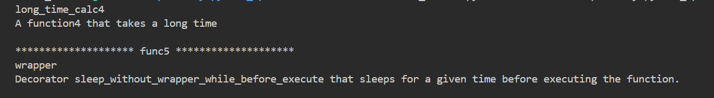

---
tags:
  - python
  - metaprogram
  - metaclass
---
`meta program` 称为元编程，也称为 `the class of class`。也就是在runtime 阶段， 动态修改程序的 metadata，来改变程序的行为。 常见的 meta programing as below：

	1.decorate (装饰器)
	2.metaclass
	3.code generate

那么meta programing可以做什么呢? 

> decorate

顾名思义，装饰器可以在不修改原方法的情况下对 原有的方法进行增强。如：可以分别在方法执行前后记录当前时间，以此来衡量方法的执行时间。

decrate 分为两种，分别是`method decrate`  和 `class decrate`

```python
## 1. function decorate
def log_info(func):
    def wrapper(*args, **kwargs):
        print("start")
        now = time.time()
        result = func(*args, **kwargs)
        print(f"end: {time.time() - now}")
        return result
    return wrapper

def record_info(min, max):
    def record_operation(func):
        @wraps(func)
        def wrapper(*args, **kwargs):
            # mock record into database
            val = random.randint(min, max)
            now = time.time()
            time.sleep(val)
            print("record start")
            func(*args, **kwargs)
            print(f"record end: {time.time() - now}")
        return wrapper
    return record_operation


@log_info   ## 语法糖
def long_time_calc():
    """A function that takes a long time
    """
    time.sleep(1)
    print("long time calc")

  
@record_info(1,10)
def long_time_calc2():
    """A function that takes a long time
    """
    time.sleep(1)
    print("long time calc2")
```


```python
## 2. class decrate
class persist_record_into_db:
    def __init__(self):
        pass

	def __call__(self, func):
        @wraps(func)
        def wrapper(*args, **kwargs):
            # mock record into database
            now = time.time()
            print("persist record start")
            func(*args, **kwargs)
            print(f"persist record end: {time.time() - now}")
        return wrapper


@persist_record_into_db()
def long_time_calc3():
    """A function that takes a long time
    """
    time.sleep(1)
    print("long time calc3")


## decrate with parameter
class sleep_while_before_execute:

    def __init__(self, sleep_time):
        self.sleep_time = sleep_time

    def __call__(self, func):
        @wraps(func)
        def wrapper(*args, **kwargs):
            time.sleep(self.sleep_time)
            return func(*args, **kwargs)
        return wrapper


@sleep_while_before_execute(2)
def long_time_calc4():
    """A function that takes a long time
    """
    time.sleep(1)
    print("long time calc4")
```

那么其中的 `@wrapper` 什么作用呢?  其实就是保留原来方法的 method, docstring etc.

example:
```python
class sleep_while_before_execute:
    def __init__(self, sleep_time):
        self.sleep_time = sleep_time

    def __call__(self, func):
        @wraps(func)
        def wrapper(*args, **kwargs):
            """Decorator that sleeps for a given time before executing the function.
            """
            time.sleep(self.sleep_time)
            return func(*args, **kwargs)
        return wrapper


class sleep_without_wrapper_while_before_execute:
    def __init__(self, sleep_time):
        self.sleep_time = sleep_time

    def __call__(self, func):
        def wrapper(*args, **kwargs):
            """Decorator sleep_without_wrapper_while_before_execute that sleeps for a given time before executing the function.
            """
            time.sleep(self.sleep_time)
            return func(*args, **kwargs)
        return wrapper

@sleep_while_before_execute(2)
def long_time_calc4():
    """A function4 that takes a long time
    """
    time.sleep(1)
    print("long time calc4")

@sleep_without_wrapper_while_before_execute(2)
def long_time_calc5():
    """A function5 that takes a long time
    """
    time.sleep(1)
    print("long time calc5")
    
if __name__ == "__main__":
    print(long_time_calc4.__name__)
    print(long_time_calc4.__doc__)
```




> metaclass

metaclass 可以由于`控制 class的创建`。
如：
	1. 在class 创建实例前把所有属性修改为 小写
	2. 创建前动态添加方法 或 field 到class instance中
	3. 在创建instance前，进行一些校验。


example，实例化前把class的属性修改为小写
```python
### convert all attributes key to lower case
class lowercase_meta(type):
    def __new__(cls, name, bases, attrs):
        print(f"cls is {cls}, name is {name}, bases is {bases}, attrs is {attrs}")
        lowercase_attrs = {}
        for key, value in attrs.items():
            if not key.startswith("__") and isinstance(key, str):
                lowercase_attrs[key.lower()] = value
            else:
                lowercase_attrs[key] = value
        return super().__new__(cls, name, bases, lowercase_attrs)


class Person(object, metaclass=lowercase_meta):
    ## class attribute
    Attribute1 = "value1"
    Attribute2 = "value2"

    def __init__(self, name, age):
        # instance attribute
        self.name = name
        self.age = age
```

在此 __new__方法中，四个参数分别表示：
```shell
cls: class 类本身, 不是 instance
name: 类名
bases:  父类
attrs: 属性

当前实例中的内容如下：
cls is <class '__main__.lowercase_meta'>, name is Person, bases is (<class 'object'>,), attrs is {'__module__': '__main__', '__qualname__': 'Person', 'Attribute1': 'value1', 'Attribute2': 'value2', '__init__': <function Person.__init__ at 0x7c2d70d76b60>}
```


Singleton:
```python
### overwrite __new__ method to support singleton and add a specifc queue to instance
class Singleton:
    _instance= {}
    def __new__(cls):
        if cls not in cls._instance:
            cls._instance[cls] = super(Singleton, cls).__new__(cls)
            cls._instance[cls].queue = queue.Queue()
        return cls._instance[cls]


def test_singleton():
    s1 = Singleton()
    s2 = Singleton()
    assert s1 is s2, "s1 and s2 are not the same instance"
    assert s1.queue is s2.queue, "s1 and s2 queue are not the same instance"
```


> code generate

code generate 即可以动态生成一些代码，并且在runtime期间可以进行调用。

```python
code = """
def coder():
    print("This is a code generator function.")
    return "code"
"""

## exec can dynamic define code
exec(code, globals())
result = coder()
print(f"result from generate code: {result}")

  
code = "lambda: 1 + 2"
## eval use to evaluate sing expression
result = eval(code)()
print(f"result from generate code: {result}")
  
result = eval("1 + 4")
print(f"result from generate code: {result}")
```

其中`exec` 方法强大，可以动态定义方法，而`eval` 用于解析比较简单的 single expression。


