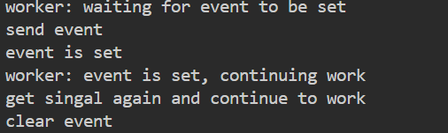
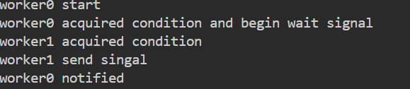
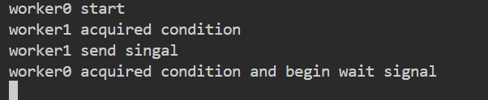
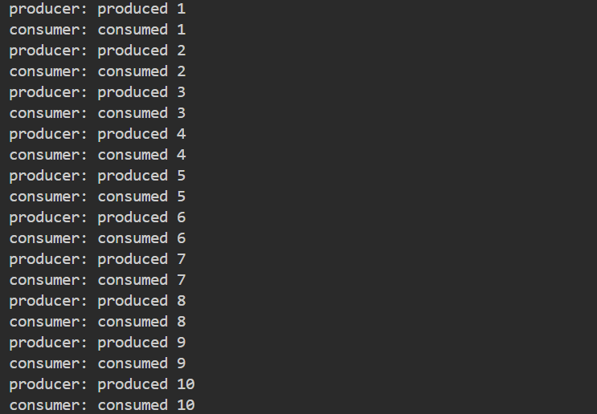

---
tags:
  - thread
  - python
  - communicate
---
Three are 3 ways to communicate between python threads.
	1. Event
	2. Condition
	3. Queue


thread communicate with Event
```python
import threading
import time

event = threading.Event()
def worker0():
    print("send event")
    ## set event, 表示发送信号
    event.set()
    print("event is set")
    time.sleep(1)
    print("clear event")
    ## 清除信号, 需要信号的则会等待
    event.clear()
  

def worker1():
    print("worker: waiting for event to be set")
    ## 等待信号, 直到 event 被set
    event.wait()  # Wait until the event is set
    print("worker: event is set, continuing work")
    ## 如果event 被 set, 则条件成立,继续运行
    while not event.is_set():
        print("worker: waiting event to continue work")
        time.sleep(1)
    print("get singal again and continue to work")

def test_event():
    t1 = threading.Thread(target=worker1)
    t1.name = "worker1"
    t1.start()

    t0 = threading.Thread(target=worker0)
    t0.name = "worker0"
    t0.start()
```




Condition
```python
import threading

condition = threading.Condition()

def worker0():
    print("worker0 start")
    ## maunal 获取 condition
    condition.acquire()
    print("worker0 acquired condition and begin wait signal")
    ## 等待 condition notify
    condition.wait()  # Wait until notified
    print("worker0 notified")

  
def worker1():
	## 获取condition, 方法执行完后, 自动释放
	with condition:
        print("worker1 acquired condition")
        condition.notify()  # Notify one waiting thread
        print("worker1 send singal")

  
t0 = threading.Thread(target=worker0)
t0.name = "worker0"
t0.start()

t1 = threading.Thread(target=worker1, name="worker1")
t1.start()

t0.join()
t1.join()
```


worker1 notify before worker0 wait,  so worker0 will wait notify forever.


share Queue
```python
import threading
import queue
import time

## standard producer and consumer

def producer(queue):
    for i in range(1, 11):
        queue.put(i)
        print(f"producer: produced {i}")
        time.sleep(1)

def consumer(queue):
    for i in range(1, 11):
        item = queue.get()
        print(f"consumer: consumed {item}")
        time.sleep(1)

queue = queue.Queue(maxsize=2)

t0 = threading.Thread(target=producer,name="producer", args=(queue,))
t1 = threading.Thread(target=consumer, args=(queue,), name="consumer")
t0.start()
t1.start()

t0.join()
t1.join()
```


