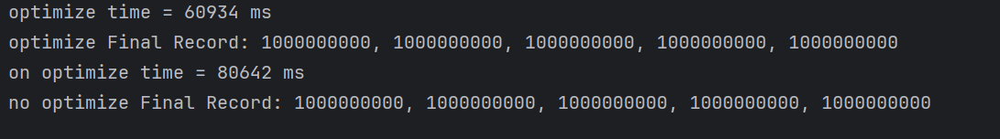

---
tags:
  - question
  - optimize
  - thread
  - volatile
---
线上 program 的监控指标使用volatile修饰, 之后进行 performance测试时, 发现耗时比较长,  如何优化呢?

> volatile 变量作用? 

volatile是 JMM模型中引入来保证`线程间变量共享`的, 以及`禁止指令重排序`的. 所以使用volatile修饰的变量, thread 读取时, 每次都从main memory读取, 写入时, 也会刷新到 main memory.


> 多线程变量共享时, 利用CPU cacheLine

根据CPU的型号,一般cacheline大小时 64bit, 那么每个线程更新变量时, 如果变量只是当前线程独享, 那么变量 load 到cacheLine后, 不需要刷到 main memory, 那么线程每次都可以从 cpu cacheline 读取到变量并更新,  其速度是最快的.


代码如下, 针对上面的情况,其实就是多线程更新Record中的变量, 导致每次都刷新变量到 main memory, 完全没有利用上cpu cacheLine.
那么针对此问题, 只要把变量彼此分开, 让其单独占用cpu cacheline.  方法就是: `添加padding`
优化后的output:



code:
```java
public class Record {  
    public volatile int count;  
    public volatile int number;  
    public volatile int status;  
    public volatile int size;  
    public volatile int maps;  
  
}

public class RecordOptimize {  
    // 为了避免伪共享，填充缓存行  
    public volatile int count;  
    public long p1, p2, p3, p4, p5, p6, p7; // 填充  
    public volatile int number;  
    public long p8, p9, p10, p11, p12, p13, p14;  
    public volatile int status;  
    public long p15, p16, p17, p18, p19, p20, p21;  
    public volatile int size;  
    public long p22, p23, p24, p25, p26, p27, p28;  
    public volatile int maps;  
    public long p29, p30, p31, p32, p33, p34, p35;  
}
```


```java
// test
import org.junit.Test;  
import java.util.Arrays;  
public class MultipleUpdates {  
    private long loop = 10_0000_0000;  
    @Test  
    public void testUpdate() throws InterruptedException {  
        Record record = new Record();  
        record.count = 0;  
        record.number = 0;  
        record.status = 0;  
        record.size = 0;  
        record.maps = 0;  
        long start = System.currentTimeMillis();  
        Thread count = new Thread(() -> {  
            for (int i = 0; i < loop; i++) {  
                record.count++;  
            }  
        });  
        Thread number = new Thread(() -> {  
            for (int i = 0; i < loop; i++) {  
                record.number++;  
            }  
        });  
        Thread status = new Thread(() -> {  
            for (int i = 0; i < loop; i++) {  
                record.status++;  
            }  
        });  
        Thread size = new Thread(() -> {  
            for (int i = 0; i < loop; i++) {  
                record.size++;  
            }  
  
        });  
        Thread maps = new Thread(() -> {  
            for (int i = 0; i < loop; i++) {  
                record.maps++;  
            }  
        });  
        Arrays.asList(count, number, status, size, maps).forEach(Thread::start);  
        maps.join();  
        count.join();  
        number.join();  
        status.join();  
        size.join();  
        long time = System.currentTimeMillis() - start;  
        System.out.println("on optimize time = "  + time + " ms");  
        System.out.println("no optimize Final Record: " + record.count + ", " + record.number + ", " + record.status + ", " + record.size + ", " + record.maps);  
    }  
  
    @Test  
    public void testUpdateOptimize() throws InterruptedException {  
        RecordOptimize record = new RecordOptimize();  
        record.count = 0;  
        record.number = 0;  
        record.status = 0;  
        record.size = 0;  
        record.maps = 0;  
        long start = System.currentTimeMillis();  
        Thread count = new Thread(() -> {  
            for (int i = 0; i < loop; i++) {  
                record.count++;  
            }  
        });  
        Thread number = new Thread(() -> {  
            for (int i = 0; i < loop; i++) {  
                record.number++;  
            }  
        });  
        Thread status = new Thread(() -> {  
            for (int i = 0; i < loop; i++) {  
                record.status++;  
            }  
        });  
        Thread size = new Thread(() -> {  
            for (int i = 0; i < loop; i++) {  
                record.size++;  
            }  
  
        });  
        Thread maps = new Thread(() -> {  
            for (int i = 0; i < loop; i++) {  
                record.maps++;  
            }  
        });  
        Arrays.asList(count, number, status, size, maps).forEach(Thread::start);  
        maps.join();  
        count.join();  
        number.join();  
        status.join();  
        size.join();  
        long time = System.currentTimeMillis() - start;  
        System.out.println("optimize time = "  + time + " ms");  
        System.out.println("optimize Final Record: " + record.count + ", " + record.number + ", " + record.status + ", " + record.size + ", " + record.maps);  
    }  
}
```


