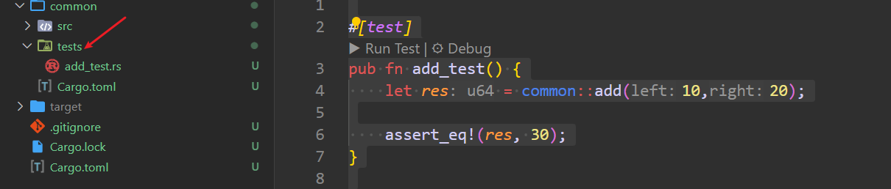
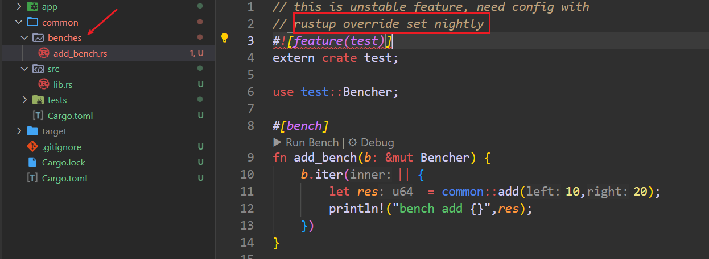

---
tags:
  - rust
  - rust-unit-test
  - unittest
---
For a project, the unit-test and intergrate-test is nessesary, so how to write unit test for rust? 

There are 3 kind of tests for rust: `unit-test, integrate test, doc-test`.


#### 1. unit test

```rust
// normally, the unit test is written in the same file as function

// lib.rs

pub fn add(left: u64, right: u64) -> u64 {
    left + right
}

#[cfg(test)]
mod tests {
    use super::*;
    #[test]
    fn it_works() {
        let result = add(2, 2);
        assert_eq!(result, 4);
    }
}

```


#### 2. doc test
```rust
// doc test for function
// doc test:  cargo test --doc
/// # Example:
/// ```
/// assert_eq!(common::add(1,3),4);
/// ```
pub fn add(left: u64, right: u64) -> u64 {
    left + right
}

```

`/// and /* */`  is the doc test for **element level**.  like: struct, function, enum .
`//! and /*! */`  is the doc test for **module level**, like:  lib.rs and main.rs.  its usually at the start of file.

#### 3. integrate test
The integrate test usually in the tests folder , tests at the same level as src.  The integrate test is at the user side, the test the public interface that use can make use of.

```rust
// run test:  cargo test
#[test]
pub fn add_test() {
    let res = common::add(10,20);
    assert_eq!(res, 30);
}
```



#### 4. bench mark
benchmarks are all in benches folder.

```rust
// this is unstable feature, need config with

// rustup override set nightly
#![feature(test)]
extern crate test;
use test::Bencher;

#[bench]
fn add_bench(b: &mut Bencher) {
    b.iter(|| {
        let res  = common::add(10,20);
        println!("bench add {}",res);
    })
}
```



we can also create benches with `criterion`, which support bench for stach rust.

```shell
# add dependency
cargo add criterion --dev --features html_reports

## Cargo.toml
[dev-dependencies]
criterion = { version = "0.7.0", features = ["html_reports"] }


```

benchmark test file:
```rust
// add_bench.rs

use criterion::{criterion_group, criterion_main, Criterion};

fn add_bench2(c: &mut Criterion) {
    c.bench_function("add", |b| {
        b.iter(|| common::add(2,2));
    });
}
criterion_group!(benches, add_bench2);
criterion_main!(benches);
```

```rust
// multipy_bench.rs
use criterion::{criterion_group,criterion_main,Criterion};

fn multipy_bench(c: &mut Criterion) {
    c.bench_function("multipy", |b| {b.iter(|| common::service::multipy(10, 20));});
}

criterion_group!(benches, multipy_bench);
criterion_main!(benches);
```

add bench config in Cargo.toml
```toml
[[bench]]
name = "add_bench"
harness = false


[[bench]]
name = "multiply_bench"
harness = false

```

then run the benchmark with below command:
```shell
cargo bench
```
