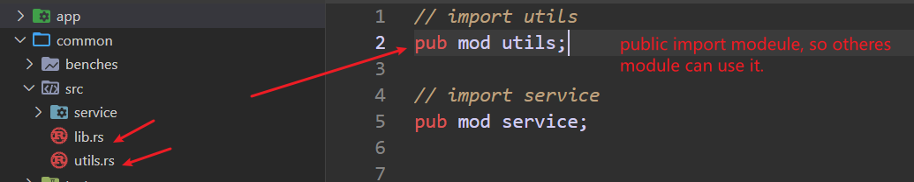
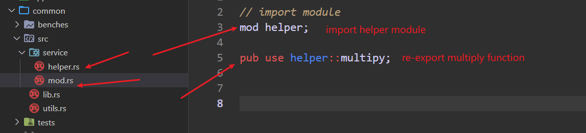

---
tags:
  - rust
  - module
  - import
  - export
---
how to import and re-export function from module in rust? This page will give the answer .


#### 1. import
```rust
// import utils module
pub mod utils;
```



import utils with `pub mod utils`, so we can use the functions in utils like:  `common::utils::minus`.

#### 2. re-export



The import `mod helper`, which is private import, so the app can't use the function in helper module.  But `pub use helper::multiply` re-export multiply function to `serivce` module, so we can use this function like: `common::service::multiply`.


