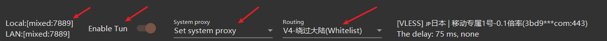
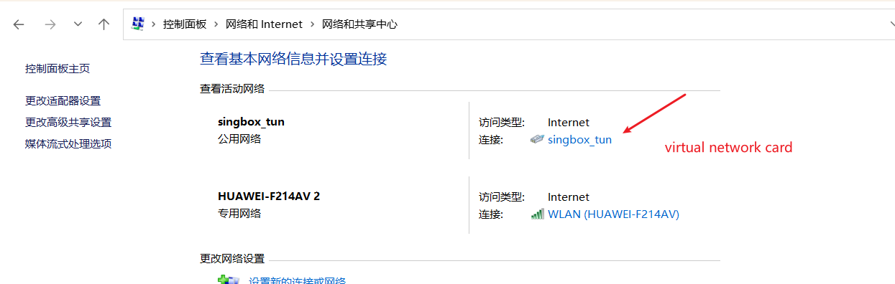

---
tags:
  - windows
  - proxy
  - v2RayN
  - TUN-mode
---
## Understanding V2RayN TUN-Mode

### What is TUN-Mode and what is its function?

TUN-Mode acts as a virtual network adapter, intercepting all network traffic at the system level and redirecting it through the V2Ray core. This ensures that applications cannot bypass the proxy.

Once TUN mode is enabled, all network traffic is forcibly routed through the V2Ray core for processing, ensuring that applications cannot bypass the proxy.

### Traffic Flow Diagram

The following diagram illustrates how network traffic is handled with TUN-Mode enabled:

```shell
application
	|
	|___  OS network stack
			|
			|__ __ TUN virtual network card
						|
						|_ _ _ V2Ray Core
								|
								|_ _ _ international internet
```

### V2RayN Configuration Steps

To configure V2RayN for TUN mode, follow these steps:

*   **Socks Proxy Port**: Ensure this is set to `7889` (this value is configurable).
*   **Enable TUN**: Activate the TUN mode option.
*   **Set System Proxy**: Verify that V2RayN has correctly set the system proxy.
*   **Routing Rules**: Configure the necessary routing rules as depicted in the screenshot below.



### Verifying TUN Mode in Windows 11

After enabling TUN mode, you can confirm it is active in Windows 11:

1.  Open `Control Panel`.
2.  Navigate to `Network and Internet` > `Network and Sharing Center`.
3.  Examine the `Network Connections`. You should see a virtual TUN network adapter listed.

